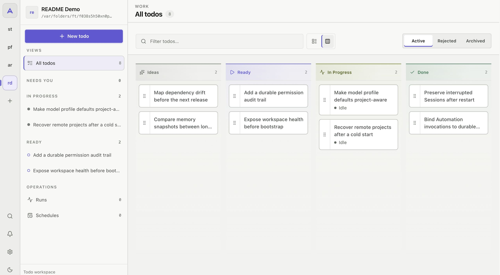
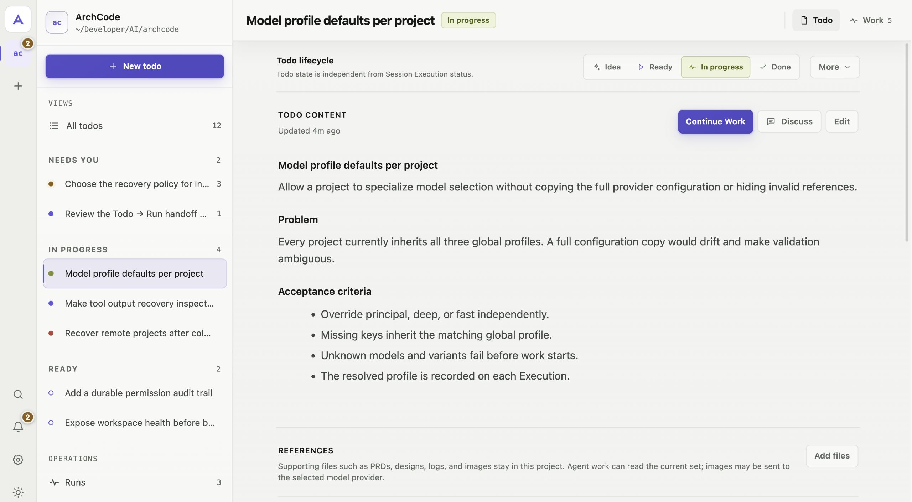
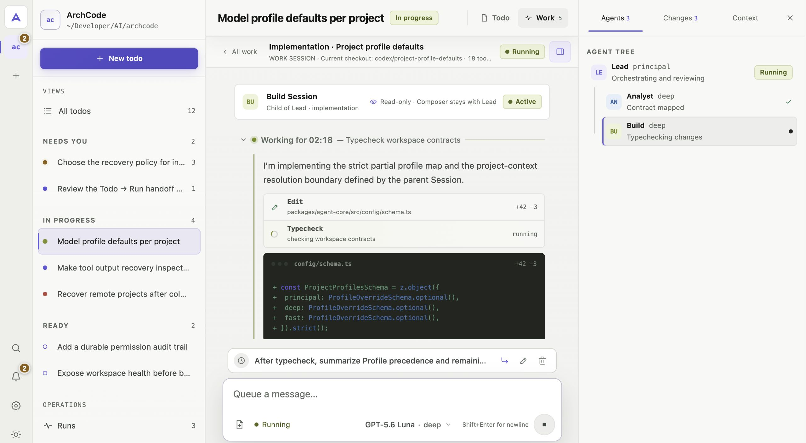

# ArchCode

> **The open-source workbench for AI coding.**

Capture project work as durable Todos, carry it out in one or more inspectable
Agent Sessions, and review the evidence before you mark it done. Self-host
ArchCode on your machine or server and connect the model providers you choose.

[](docs/assets/archcode-readme-workbench.jpg)

*Ideas, ready work, active work, and completed work stay visible in one Project.*

## How ArchCode works

1. **Capture a Todo** — record something you want to build, fix, investigate, or
   improve in an existing Project.
2. **Shape it when useful** — open a dedicated Discussion to clarify the work,
   and keep an optional Markdown Plan with the Todo.
3. **Run the work** — start one or more Lead Sessions, or create an Automation
   to start it once later or on a recurring schedule.
4. **Stay involved** — follow the work, add instructions, answer questions, and
   approve sensitive actions from the Web workbench.
5. **Review and finish** — inspect changes, tool output, tests, and Session
   history, then decide when the Todo is Done.

Use **Run now** to create a Todo and start its first Session in one step, without
a Discussion or Plan. You can also start an ordinary Session without a Todo.

## Quick start

### 1. Install

```sh
curl -fsSL https://github.com/boh5/archcode/releases/latest/download/install.sh | sh
```

The installer downloads the correct macOS or Linux binary, verifies its
checksum, and installs it without `sudo`. Installer-managed copies can later
update from **Settings → About & Updates** or `archcode update`. If
`~/.local/bin` is not on `PATH`, follow the exact instruction printed by the
installer.

### 2. Start

```sh
archcode
```

### 3. Open the workbench

Open [http://localhost:4096](http://localhost:4096). On first run, the browser
setup guides you through connecting a model and optionally protecting the
workbench with a password.

### 4. Add a project

Choose an existing project directory. Capture project work as a Todo or start a
Session directly. ArchCode works with the files and Git repository already on
the machine where it runs.

Need another platform, manual verification, or a remote deployment? See the
[installation](docs/installation.md) and [deployment](docs/deployment.md)
guides.

## Keep project work organized

A Todo gives each feature, bug, refactor, experiment, or investigation a durable
place in its Project. Keep the request, lifecycle, acceptance criteria,
references, and optional Markdown Plan together as the work moves from Idea to
Ready, In Progress, and Done.

[](docs/assets/archcode-readme-todo-detail.jpg)

*A Todo detail keeps the request, lifecycle, acceptance criteria, references,
and related work together.*

Register multiple existing workspaces and return to them from the same Web
workbench. Start multiple Sessions from a Todo when the work needs separate
investigation, implementation, or review without mixing everything into one
conversation.

## Inspect and control every Session

Each Session keeps its own conversation, selected model, working directory,
tool activity, approvals, execution state, and history. Follow active work, add
instructions, queue the next message, answer questions, approve sensitive
actions, or stop an Execution.

[](docs/assets/archcode-readme-session-agents.jpg)

*The Lead coordinates an Analyst and a Build Agent while each Agent's work
remains individually inspectable.*

Before accepting the result, inspect file changes, tool output, test results,
review summaries, and the complete Session history.

### Specialized Agents, clear responsibilities

| Agent | Responsibility | Model Profile |
|---|---|---|
| Lead | Owns the outcome, works directly, and coordinates other Agents | `principal` |
| Discussion | Shapes one Todo and its optional Plan without implementing it | `principal` |
| Analyst | Deep analysis, planning support, and review | `deep` |
| Build | Implementation and verification | `deep` or `fast` |
| Explore | Fast codebase investigation | `fast` |
| Librarian | Documentation and external research | `fast` |

The Lead delegates bounded responsibilities when specialized work is useful.
Each Agent identity has its own tools, delegation rules, and authority.

## Self-host the runtime and choose the models

Run ArchCode on a laptop, workstation, Mac mini, home server, or VPS. The same
server runtime and Web UI work in every deployment, and active work runs on the
ArchCode host rather than in the browser. Closing the page does not cancel an
Execution while the process and machine remain running.

ArchCode runs its own Agent loop rather than remotely controlling an existing
Claude Code, Codex, or another coding CLI process. Its server owns Agent
execution, projects, Sessions, tools, approvals, memory, and durable state. The
browser is the control interface, not the place where the Agent runs.

ArchCode separates Agent responsibility from model choice. Connect official AI
SDK providers, custom OpenAI-compatible endpoints, or Responses-compatible
endpoints. Configure `principal`, `deep`, and `fast` Profiles, then use stronger
models where judgment matters and fast or local models for exploration and
routine work. See [provider and model configuration](docs/configuration.md).

ArchCode does not claim to make the underlying model smarter. It gives models a
self-hosted runtime, specialized responsibilities, and a persistent project
workbench.

## More built in

- Structured file, shell, Git, search, LSP, Web, memory, and MCP tools
- Built-in and project workflow Skill packages for Todo shaping, planning,
  review, and repeatable working methods
- Automations that start or resume work once or on a recurring schedule
- Optional Goals that keep one Lead focused across multiple Executions and
  human checkpoints, with a required final review
- Inspectable Markdown memory and context compaction
- Optional Git worktree execution
- GitHub plus live HTTP/STDIO MCP integrations
- Signed direct updates with an idle-only graceful restart

Learn the product vocabulary in [workbench concepts](docs/concepts.md), and see
[GitHub and MCP integrations](docs/integrations.md) for the complete integration
schema.

## Know before you self-host

- ArchCode is currently designed for a single private operator, not a
  multi-user team deployment.
- Remote deployments require authentication and HTTPS or a trusted reverse
  proxy.
- Git worktrees provide Git-level separation, not an operating-system sandbox.
- Registered workspace files stay on the machine running ArchCode, but external
  model providers receive the context required for model calls.
- ArchCode can continue work while a browser is closed as long as its process
  and machine remain running. An active Execution does not survive a server
  process restart in the current release.
- macOS binaries are not currently signed or notarized. Windows is supported
  through WSL2; native Windows execution is not yet available.

Read the full [security and trust boundaries](docs/security.md) before exposing
ArchCode outside a trusted machine or network.

## Documentation

- [Installation and platform support](docs/installation.md)
- [Local and remote deployment](docs/deployment.md)
- [Provider and model configuration](docs/configuration.md)
- [Workbench concepts](docs/concepts.md)
- [GitHub and MCP integrations](docs/integrations.md)
- [Security and trust boundaries](docs/security.md)
- [Security vulnerability reporting](SECURITY.md)
- [Architecture](docs/architecture.md)
- [Contributing](CONTRIBUTING.md)
- [Changelog](CHANGELOG.md)

## Contributing

Contributions are welcome. Development setup, architecture notes, testing
conventions, and pull request guidance live in [CONTRIBUTING.md](CONTRIBUTING.md).

## License

ArchCode is available under the [MIT License](LICENSE).
