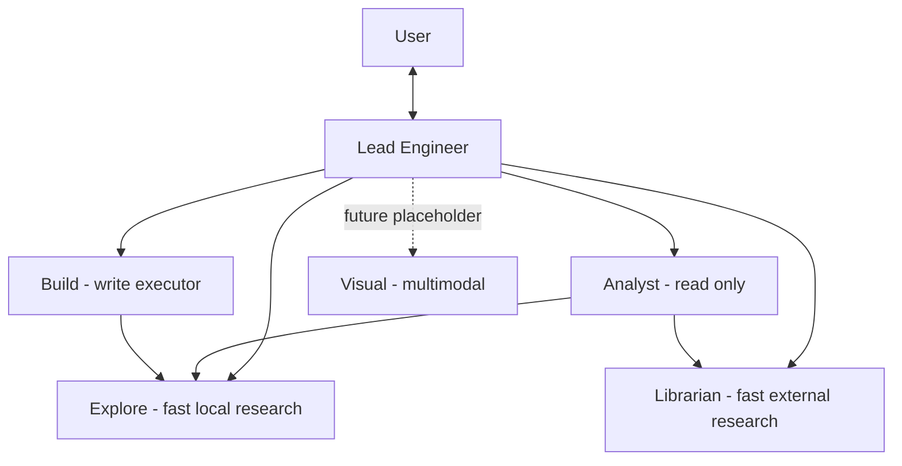
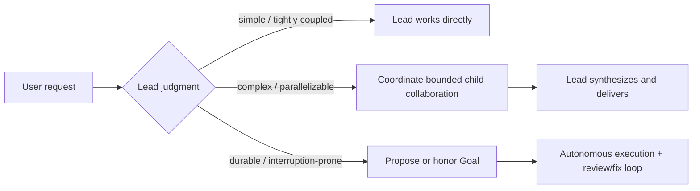

# Lead Agent、ULW、Plan 与 Goal 架构 Draft

> 状态：Draft。核心产品方向已经确认，具体配置 Schema、hard-cut 实施顺序和交互合同仍需在实施计划中细化。
>
> 日期：2026-07-21
>
> 本文最初记录 ArchCode 从 Engineer、Shaper、Plan、Build、Reviewer、Explore、Librarian 七种 Agent 身份收敛的目标架构；该 hard cut 现已落地为 Lead、Analyst、Build、Explore、Librarian 五种 Agent 身份。本文保留产品决策依据，当前验收状态以配套 Goal 与 Progress 文档为准。

## 1. 一句话结论

ArchCode 不再沿着“每一种工作角色对应一个 Agent”的方向扩张，而是形成一套更小、更稳定的架构：

> 一个始终面向用户、能够直接工作的 Lead Engineer，按需调度少量具有真实权限或上下文边界的子 Agent；工作方法由 Skill 表达，模型强度由 Profile 表达，持久执行由可选 Goal 表达，Plan 只是普通 Markdown 决策文件。

ArchCode 默认就是 ULW 式的选择性协作，不需要命令、模式开关或 UI 激活。简单工作由 Lead 直接完成，复杂工作由 Lead 调度多个子 Agent；Analyst、Build 和 Todo Discussion 可以继续把轻量研究委派给 Explore/Librarian，更长、更容易中断的工作可以在用户授权后开启 Goal 持续完成。

## 2. 为什么要收敛

重构前的七 Agent 架构把身份、工作阶段、模型配置和工作方法部分绑定在了一起。继续为研究、规划、塑形、视觉、测试、安全等每一种角色新增 Agent，会带来四个问题：

1. 用户和主 Agent 都必须先理解复杂的角色表，才能开始工作。
2. Agent 之间容易形成 Prometheus、Metis、Atlas 一类串行交接链，增加延迟、成本和信息损失。
3. 大量角色实际只有 Prompt 差异，没有独立权限、上下文或结果责任，应该是 Skill，而不是 Agent。
4. 每增加一个 Agent，配置、模型选择、Prompt、工具权限、委派关系、测试和 UI 元数据都会同步膨胀。

因此，只有满足以下至少一个条件时，才应该保留独立 Agent 身份：

- 需要不同的运行时工具权限；
- 需要隔离上下文，避免污染主对话；
- 需要独立、不可由执行者替代的责任边界；
- 需要不同的输入或输出模态。

其余差异优先放入 Skill 或 Profile。

## 3. 目标概念边界

| 概念 | 回答的问题 | 是否持久化 | 是否改变权限 |
|---|---|---:|---:|
| Agent | 谁在负责，以及它能做什么 | Session 持久化身份 | 是 |
| Skill | 应该采用什么工作方法与输出合同 | 记录激活名称，执行时解析正文 | 否 |
| Profile | 这次任务需要多强、哪种模态的模型资源 | 委派时持久化选择 | 否 |
| Plan | 准备怎样完成这件事 | 普通 Markdown 文件 | 否 |
| Goal | 是否需要跨轮次、重启和 HITL 持续推进到可验证终点 | root Lead Session 上的协议状态 | 不直接改变 |
| Todo | 项目层面的待塑形意图 | 项目持久化 | 由运行时限定更新范围 |

这些概念不能建立一一对应关系：

- 一个 Agent 可以使用多个 Skill；
- 同一 Agent 可以使用不同 Profile；
- 同一种 Analyst 身份可以通过不同 Skill 承担架构分析、缺口分析、Plan 冷审、普通审查和 Goal 最终审查；
- 审查独立性来自独立 Session 和运行时认可的审查来源，不要求永久存在一个 Reviewer Agent；
- 有 Plan 不代表必须有 Goal；
- 有 Goal 不代表必须先写 Plan；
- Todo Discussion 是一种受限的 Lead Session，不需要单独的 Shaper 身份。

## 4. 目标 Agent 架构

目标 Agent 目录收敛为：

| Agent | 核心边界 | 默认 Profile | 可选 Profile | 是否可委派 |
|---|---|---|---|---:|
| `lead` | 用户入口、技术决策、直接工作、总调度、整合、交付 | `principal` | Session override | 是，拥有 family 总调度权 |
| `analyst` | 深度只读分析、架构推演、规划辅助、独立审查 | `deep` | 无 | 是，仅 Explore/Librarian |
| `build` | 承接边界清楚的实现任务并完成验证 | `deep` | `fast` | 是，仅 Explore |
| `explore` | 轻量本地搜索、LSP 和代码证据收集 | `fast` | 无 | 否 |
| `librarian` | 轻量外部文档、代码参考和最新事实研究 | `fast` | 无 | 否 |
| `visual` | 预留的独立多模态能力入口；第一次 hard cut 不启用 | 无 | 未来 `visual` | 否 |

`visual` 在第一次 hard cut 中只做架构占位，不作为可运行的 built-in Agent：

- 保留 `visual` 名称、未来能力边界和文档位置；
- 第一阶段不注册 Visual Agent，不要求 `visual` Profile，不进入委派目标、运行时或 UI；
- 第一阶段不实现附件传递、多模态 Session、浏览器视觉 QA 或降级路径；
- 以后只有在图片等附件能够可靠进入独立子 Session 时，才单独启用 Visual；
- Visual 不可用时明确不可用，不回退到不具备视觉能力的 Analyst。

未来 Visual 的独立性来自输入模态和上下文隔离，而不只是 Persona 差异；占位本身不产生配置、权限或运行时行为。

核心 Agent 目录由 ArchCode 固定，不允许用户任意增加 PM、Architect、Security、Frontend、QA 等新 Agent 身份。用户通过 Profile 选择模型资源，通过 Skill 增加专业方法和领域能力。未来若开放 Agent 扩展，也必须先定义新的稳定权限、上下文或结果责任边界，不能把自定义 Persona 当作 Agent。

### 4.1 为什么用 `lead`

目标内部 ID 建议使用 `lead`，产品显示名使用 **Lead Engineer**。

`engineer` 容易被理解为“亲自写代码的人”，低估了它在用户关系、技术决策、调度、HITL、Goal 和最终交付上的责任；`principal` 更适合作为默认模型 Profile，而不是 Agent 名称。`lead` 简短，也能准确表达单一责任入口。

不需要为改名单独制造兼容层。目标实现采用一次完整 hard cut，直接将内部 `engineer` ID、配置、Prompt、Session 合同和 UI 统一切换到 `lead`，不兼容或迁移旧数据。

### 4.2 Lead 不是纯 Coordinator

Lead 不是 OMO Atlas 式只负责派单的协调器。它是整个工作的技术所有者，必须具备直接读写、运行、验证和交付能力。

Lead 负责：

- 与用户讨论意图、约束、取舍和验收标准；
- 判断任务是否需要直接完成、委派协作或持久 Goal；
- 选择子 Agent、Profile 和必要 Skill；
- 对关键路径、简单修改和高耦合工作直接动手；
- 综合用户讨论、仓库证据和子 Agent 结果，作出最终技术判断；
- 拥有并写入最终 Plan 文件；
- 在适合时提出 Goal，但不替用户授权 Goal；
- 处理 HITL、失败恢复、范围变化和子 Agent 结果冲突；
- 驱动 review → fix → review 闭环；
- 向用户交付最终结果和真实验证证据。

Lead 不应该：

- 为了展示协作而强制 fan-out；
- 把最终技术判断外包给子 Agent；
- 把一项工作拆成多层递归 Agent 链；
- 用 Skill 绕过运行时权限；
- 审批自己完成的 Goal。

### 4.3 保留有界的浅层委派

委派层数和现有合理能力保持不变，不为了角色收敛把所有子 Agent 强行改成终端节点：

- 普通 Lead 可以委派 Analyst、Build、Explore、Librarian，最大深度保持 3；
- Analyst 吸收原 Plan/Reviewer 的能力，可以委派 Explore、Librarian，最大深度保持 2；
- Build 可以委派 Explore，最大深度保持 2；
- Todo Discussion 保留原 Shaper 的研究委派能力，只能委派 Explore、Librarian，最大深度保持 2；
- Explore、Librarian 才是终端节点，不能继续委派。



这保留了“复杂子任务继续外包轻量检索”的必要能力，同时通过固定 target matrix 和既有深度上限避免开放式递归或 Atlas → Prometheus → Metis → Momus 一类角色链路。

### 4.4 Analyst 吸收复杂分析与审查能力

ArchCode 不应遗漏 OMO 中 Oracle、Metis 和 Momus 提供的复杂认知能力，但不为每一种分析视角创建永久 Agent：

| OMO 能力 | ArchCode 表达 |
|---|---|
| Oracle：复杂架构、调试和技术取舍 | Analyst + `architecture-analysis` / `complex-debugging` |
| Metis：隐藏意图、歧义、遗漏和过度设计检查 | Analyst + `gap-analysis` |
| Momus：Plan 完整性、可执行性和可验证性审查 | 独立 Analyst + `plan-review` |
| 普通实现审查 | Lead + `review-work` 编排；独立 Analyst 加载具体审查 Skill |
| Goal 最终完成审查 | 独立 Analyst + `goal-review` |

Lead 可以按风险创建一个或多个相互独立的 Analyst Session，从不同视角分析同一问题。Analyst 可以委派 Explore/Librarian 补充事实，但必须自己综合并向父 Agent 返回最终分析；不能继续委派 Analyst、Build 或形成 Planner → Reviewer → Executor 的角色链。

`review-work` 属于 Lead 的审查编排 Skill，不属于 Analyst。它负责收集当前目标、约束、改动和验证证据，并按风险选择审查方法。普通审查默认只创建一个 Analyst，该 Analyst 可以同时加载完成本次审查所需的多个相关 Skills；只有确实需要相互独立的观点或风险隔离时，Lead 才增加其他 Analyst。普通复审可以 resume 原 Analyst，由 Lead 根据上下文污染和独立性要求决定是否创建 fresh Session；Goal 最终审查遵守更严格的独立性规则。

Analyst 保持源码只读，不修改产品代码，不控制 Goal 状态。这里的“源码只读”是指没有结构化源码写入能力；Analyst 仍保留原 Plan/Reviewer 所需的调查、诊断和验证能力。`goal-review` Skill 只定义最终综合审查方法和严格 Verdict 合同；完成权威来自一个由 Goal 工作流认可的 fresh 独立审查 Session 及运行时校验，不能因为普通 Analyst 加载了该 Skill 就自动获得。风险型 review 是 Lead 的工作方法，不新增 Review 领域状态机；Goal runtime 只机械认可最终指定的独立 `goal-review` 结果。

Analyst 是条件调用的深度能力，不是所有非简单任务的必经阶段：

- 多步骤、跨文件或工作量大，本身不构成调用 Analyst 的理由；
- 存在开放设计、架构取舍、高风险重构、复杂调试、隐藏需求或需要独立批判时调用；
- 路径已经明确、只是执行量较大时，Lead 可以直接规划并委派 Build，不必先调用 Analyst；
- 高风险 Plan 可以使用独立 Analyst + `plan-review`，但普通 Plan 不强制冷审；
- Goal 最终完成必须使用独立 Analyst + `goal-review`。

这避免把 Analyst 重新变成强制 Planner/Metis/Momus 流水线，同时保留在真正困难问题上投入 deep 推理和多个独立视角的能力。

### 4.5 委派内聚与职责分离

Lead 外包边界清楚的结果，但不外包最终责任：

- Explore 负责本地事实和证据，不替 Lead 作产品或架构决策；
- Librarian 负责外部事实和参考，不决定最终技术方向；
- Analyst 负责深度分析、批判和独立审查，不修改源码或控制 Goal；需要补充事实时可以委派 Explore/Librarian；
- Build 只对本次委派目标的实现和验证负责，不自行扩大产品范围；需要本地检索时可以委派 Explore；
- Visual 在第一次 hard cut 中只是占位，不参与实际工作；
- Lead 负责解决子 Agent 结论冲突、写最终 Plan、驱动修复并向用户交付；
- Runtime 负责权限、并发、Goal continuation 和完成真实性。

每次委派都应围绕一个可交付结果组织，而不是让子 Agent 扮演模糊角色。Agent 身份提供稳定能力边界，Skill 提供本次任务的方法，Profile 提供模型资源强度。

### 4.6 Lead 与 Build 的外包关系

Lead 既是技术所有者，也具备直接实现能力；Build 是边界明确的实现承包者。二者遵守以下协作原则：

- 简单、高耦合、关键路径或 Lead 已经掌握完整上下文的修改，由 Lead 直接完成；
- 范围清楚、可以独立实现和验证的工作，Lead 可以外包给 Build；
- 委派目标可以在自然语言 Prompt 中说明相关文件或模块，但不新增结构化 `owned_scope` / `write_scope` 字段；
- 不实现路径所有权、文件租约、写入 ACL 或范围状态机；
- Lead 只并行委派明显独立的实现任务；已知会修改相同文件、共享状态或存在依赖的工作保持串行；
- 运行时允许多个 Build 同时执行，不增加单 active Build 限制；并行与串行完全由 Lead 根据任务事实判断；
- Build 遇到用户或其他执行者产生的陌生改动时不覆盖、不回滚，交由 Lead 协调；
- Build 返回实现与验证证据，Lead 负责整合、冲突解决、最终验证和用户交付；
- 委派失败不会把最终责任转移给 Build，Lead 仍负责重新划分、收回或修复工作。

这是一种结果外包，不是一套文件所有权系统。并行安全主要来自 Lead 的任务拆分和调度判断。

## 5. Profile 设计

第一次 hard cut 只启用三种 Profile，并为未来的 Visual 保留名称：

| Profile | 含义 | 主要使用者 |
|---|---|---|
| `principal` | 所有 root Lead Session 的默认模型绑定 | Lead |
| `deep` | 高推理预算，适合高歧义、高风险和跨域任务 | Analyst、困难 Build |
| `fast` | 低延迟、低成本，适合边界清楚的局部任务 | Explore、Librarian、已知路径的 Build |
| `visual` | 未来具备视觉输入或视觉推理能力的模型绑定 | Visual 占位；第一阶段不配置、不启用 |

Profile 只表示模型资源和调用参数，不表示工作流阶段、Agent 身份、权限或质量标准。

### 5.1 `principal` 的唯一语义

`principal` 的唯一运行时语义是：**root Lead Session 的默认模型绑定**。

它覆盖：

- 普通 Lead Session；
- 从 Project Todo 进入的 Discussion Session；
- Ready Todo 创建的新 Lead 执行 Session；
- Automation 创建的 Lead Session；
- Goal continuation；
- 用户清除 Session override 后恢复默认绑定。

`principal` 不是“最强模型”的同义词，不参与子 Agent 的强度路由，也不应成为 `fast` 与 `deep` 之外的第三档。

用户可以为某个 root Lead Session 选择其他模型、variant 和 options。解析优先级为：

```text
Lead Session override > principal default
```

Session override 应整体替换 principal 的模型绑定，不能把某个 provider 的 principal options 泄漏到用户选择的另一个 provider。

### 5.2 子 Agent 动态路由

Lead 在每次委派时，根据任务强度选择 Agent 和 Profile：

- 已知模式、局部范围、输入充分、低风险、结果容易验证：`fast`；
- 高歧义、架构决策、安全、并发、迁移、跨域、高风险或困难实现：`deep`；
- 未来实际需要图像理解、视觉对比或 UI 视觉判断时使用 `visual`；第一阶段不可路由。

默认规则：

- Analyst 固定使用 `deep`；不值得使用 deep 的本地查找应交给 Explore，外部查找应交给 Librarian；
- Build 默认 `deep`，Lead 可以在明确、局部、低风险且容易验证时选择 `fast`；
- Explore、Librarian 固定 `fast`；
- Visual 未来固定使用 `visual`；第一阶段不参与委派；
- Goal 最终审查使用独立 Analyst + `goal-review`，因此固定为 `deep`。

委派合同需要显式记录 `profile`。同一个子 Session 被 resume 时必须继续使用原 Profile，除非未来设计一个明确、可审计的变更合同。不能在恢复执行时重新猜测强度。

## 6. 默认 ULW 工作方式

ArchCode 不提供 `/ulw`、`ultrawork` 命令、模式开关或额外 UI。选择性多 Agent 协作就是 Lead 的默认能力。

Lead 根据工作性质选择三条路径：



ULW 在这里表示：

- 主动发现可并行的独立工作；
- 把噪声较大的探索隔离到子上下文；
- 让写入范围和独立审查责任保持清楚；
- 由 Lead 汇总和作最终判断；
- 只在协作收益大于协调成本时委派。

它不表示每个请求都必须创建多个 Agent。

### 6.1 用户只与 Lead 交互

ArchCode 对用户保持一个稳定入口：

- 用户始终向 root Lead Session 发送消息，不需要切换 Primary Agent 或学习 Agent 调用语法；
- 子 Agent Session 在 UI 中可展开和检查，展示来源、进度、工具调用、结果与审查证据；
- 子 Agent 的可见性用于透明度和审计，不把调度责任转交给用户；
- 用户的新要求、纠正或停止指令发送给 Lead，由 Lead 决定中断、调整、恢复或取消哪个子 Agent；
- 子 Agent 产生的审批与问题统一进入项目 HITL，并清楚标明来源；
- 子 Agent 不作为普通用户对话的 Primary Agent，也不形成需要用户手动导航的工作模式。

因此 ArchCode 与 OpenCode 的 Primary Agent 切换模式不同：内部可以有多个专业上下文，用户侧仍是一段由 Lead 负责的持续工作关系。

## 7. Role Prompt 与 Skill 的边界

### 7.1 Role Prompt 保留什么

Role Prompt 只保留稳定身份和不可变责任：

- Agent 是谁；
- 对什么结果负责；
- 可使用哪些工具、可修改哪些范围；
- 是否可以委派；
- 必须遵守的输出合同；
- 明确禁止的行为。

### 7.2 Skill 表达什么

可复用的工作方法迁移到 Skill。第一阶段只固定生命周期所需的核心职责：

- `orchestrate-work`：Lead 的默认路由、并行和结果整合方法；
- `plan-work`：何时规划、怎样研究、怎样写最终 Plan；
- `run-goal`：Goal 持续执行、阻塞、review/fix 和完成方法；
- `shape-todo`：Todo Discussion 的澄清和更新方法；
- `review-work`：Lead 收集证据、选择审查方法并驱动修复；
- `goal-review`：Goal 最终独立审查和严格 Verdict 合同。

本地研究、外部研究、架构分析、复杂调试、gap analysis、Plan review、代码审查和安全审查等能力仍必须存在，但不在架构层锁死为“一项能力一个 Skill 文件”，也不要求为每个 Skill 创建独立 Analyst lane。实施时可以保留、重写、合并或新增高内聚的 Skills；现有 `codemap`、`research-docs`、`safe-refactor`、`git-master`、`automation-create` 等领域 Skills 不因角色 hard cut 被无条件删除。

Skill 是模型可见的操作手册，不是权限或状态权威。文件写入、Todo bound scope、并发限制、Goal continuation，以及某个 Analyst 审查是否构成 Goal 完成凭证，仍由运行时执行。Agent 可以加载存在的 builtin 或用户自定义 Skill，只要运行时身份和工具权限允许；Skill 名称或内容不能扩张工具集合。Goal 使用的保留 lifecycle Skill 由运行时注入并校验，不能被同名自定义 Skill 冒充。

## 8. Plan：文件，不是状态机

Plan 是一个可选的决策 Artifact，用于降低“怎样做”的不确定性。ArchCode Plan 固定存放在：

```text
.archcode/plans/<safe-name>.md
```

它是项目内、ArchCode 所有的本地工作资产，不是默认进入 Git 的正式产品文档。用户明确要求另行交付设计文档时，可以写入仓库约定的 `docs/` 路径，但那是交付物，不是第二套 Plan 系统。

Plan 文件可以记录：

- 目标和背景；
- 已确认约束与非目标；
- 关键证据和设计决策；
- 执行波次与依赖；
- 验收标准和验证方式；
- 风险、未知项和回退策略。

Plan 文件不应复制实时执行状态。当前步骤、执行 checklist 和进度由 Session-local Todo 或现有运行时事实表达。

Plan 不构成用户审批门或执行阶段：

- 写入 Plan 不自动暂停工作；
- 写入 Plan 不代表开启 Goal；
- 写入 Plan 不要求用户执行 `/start-work`、切换模式或批准 Plan 才能继续；
- 用户明确要求“只给方案”时，Lead 写完 Plan 后停止；
- Plan 暴露出真正的产品取舍、不可逆决定或缺失约束时，Lead 使用 `ask_user` 询问那个具体问题，而不是请求笼统的 Plan approval；
- Lead 建议持久执行时，另行通过 `ask_user` 请求 Goal 授权；
- 其他情况下，Lead 可以写完 Plan 后继续普通执行。

Plan 可以被用户查看和讨论，但不能因为存在文件就变成隐形的 `Discover → Plan approval → Execute` 状态机。

不新增以下概念：

- Plan 状态机；
- Plan 专属 Session、API 或页面；
- `planId`、Plan revision 或 Plan transition；
- Goal 上的 `planId` / `planPath`；
- `/start-work`、Boulder 或第二套执行状态；
- Plan → Goal 的结构化转换协议。

### 8.1 谁写 Plan

最终 Plan 的所有权始终属于 Lead，但研究和草拟方式是动态的：

1. 路径清楚、范围集中时，Lead 直接研究并写 Plan。
2. 存在未知设计或复杂风险时，Lead 委派 Explore、Librarian 或 Analyst 收集证据和提出候选方案。
3. Analyst 可以返回结构化分析或 Plan draft，但保持源码只读，不直接写 `.archcode/plans/`。
4. Lead 综合用户讨论、仓库证据和子 Agent 输出，作出最终判断并写 Plan 文件。
5. 高风险 Plan 可以再交给一个未参与该 Plan 形成过程的独立 Analyst，并加载 `plan-review` Skill 冷审；是否采纳反馈仍由 Lead 决定。

这既避免主对话被大量探索噪声占满，也避免形成“Prometheus 写计划、Atlas 执行计划”的双主脑交接。

## 9. Goal：可选的持久执行协议

Goal 回答的是：

> ArchCode 是否应该跨多轮执行、进程重启和 HITL 等待，持续推进到一个可验证终点？

Goal 属于 root Lead Session，不是单独的工作项、Agent、Plan 或 Workflow。它可以在有 Plan 或没有 Plan 的情况下开启。

### 9.1 Plan 与 Goal 完全正交

| | 不开启 Goal | 开启 Goal |
|---|---|---|
| 不写 Plan | 简单工作；或目标清楚但需要持续跑到终点，例如修复测试直到全绿 | 清晰、持久、可验证的长期执行 |
| 写 Plan | 只做架构/实施方案；或按计划在普通 Session 中协作 | 复杂且需要持续执行、恢复和独立完成门禁的工作 |

所以不存在固定的“讨论 → Plan → Goal”状态机：

- Plan 可以先于 Goal；
- Goal 可以在没有 Plan 时直接开启；
- Goal 开启后也可以因为新发现再补 Plan；
- 两者都可以不存在。

Plan 的路径可以作为普通文本出现在 Goal objective 或对话中，但运行时不建立结构关联。

### 9.2 Goal 激活

Goal 必须由用户明确授权，授权可以来自：

- 用户初始请求已经明确要求“持续执行、不要停、直到完成”；
- Lead 判断工作适合 Goal，通过 `ask_user` 展示完整 Goal objective，并由用户选择开启、不启动或调整目标。

Lead 可以自主判断是否建议 Goal，但不能自行扩大普通请求的持久执行授权。一旦 Goal 激活，正常 continuation、子任务协调和 review/fix 不需要每一步重新确认；只有 HITL、方向变化、真实阻塞或新增权限需要回到用户。

`ask_user` 的问题正文必须展示用户将要授权的完整 objective，不能只问“是否开启 Goal”。用户确认的是这段明确目标，而不是把“好”“可以”本身当作 objective；Goal 只能使用用户直接明确提出或刚刚通过 `ask_user` 确认的完整目标。不新增 GoalProposal 或另一套授权生命周期。用户初始请求已经明确授权持久执行时，不重复询问。

### 9.3 Goal 完成门禁

Goal 完成继续遵守独立审查：

1. Lead 完成实现和验证；
2. Goal 工作流在最后一次 ArchCode 已知的成果写入之后创建一个未参与该项设计、Plan 编写或实现的独立 Analyst Session，加载 `goal-review` Skill 并使用 `deep`；
3. 该 fresh Analyst 的最终输出首个非空行必须是 `VERDICT: APPROVED`；尚未给出最终输出而仅因中断或重启暂停时，可以 resume 同一个 Session；
4. 若为 `CHANGES_REQUESTED`，Lead 修复后重新审查；
5. 运行时机械校验审查 Session 的独立来源、Goal 归属和结果后，才允许 Goal complete。

Analyst 不控制 Goal 状态，`goal-review` Skill 本身也不授予完成权。Lead 不能用自己的结论、普通 Analyst 输出或参与过方案形成的 Analyst Session 代替这次独立审查。一次最终审查输出会结束当前尝试：`APPROVED` 可以进入完成门禁，`CHANGES_REQUESTED`、空输出或格式错误都要求以后新建 Analyst，不能 resume 后改写结论。成果再次被 ArchCode 修改或 Goal 被编辑也会使本轮最终审查失效；单纯的未完成审查恢复、进程重启以及审查 Analyst 对 Explore/Librarian 的只读委派不会使审查失效。第一阶段不增加 filesystem watcher，因此不声称检测 ArchCode 之外的外部文件修改。

## 10. Project Todo Discussion 保持不变的用户入口

Project Todo 的“进入讨论”入口必须保留。改变的是背后的 Agent 表达方式，而不是产品能力。

目标流程：

```text
Project Todo
  -> 进入讨论
  -> 创建或恢复一个绑定该 Todo 的受限 Lead Session
  -> 自动激活 shape-todo Skill
  -> 只允许更新绑定 Todo
  -> Todo Ready
  -> 创建一个新的普通 Lead 执行 Session
```

Discussion Session：

- 使用 `principal` 默认绑定，也允许正常的 Lead Session override；
- 保留现有 Shaper 所需的源码/资料读取、Git、LSP、Web、Memory、`ask_user`、受现有权限策略约束的 Bash，以及向 Explore/Librarian 委派研究的能力；
- 运行时只授予更新当前 bound Todo 的能力；
- 不能修改产品源码、创建 Goal、Automation 或其他执行资源；
- 不因为使用 Lead 身份而获得普通 Lead 的全部写权限。

Discussion 的源码只读边界不通过删除全部 Bash 来伪造；结构化源码写工具仍不可用，已知的修改性 Bash 继续由现有权限策略拒绝或询问。第一阶段不新增只读 Shell、命令 DSL 或另一套 Bash 状态机。

因此可以移除独立 `shaper` Agent，但不能移除 Todo Discussion 的 UI 入口、绑定关系和权限隔离。Todo Ready 后的新执行 Session 与 Discussion Session 分离，避免讨论上下文和权限状态混入实际交付。

## 11. 典型工作流

### 11.1 简单工作

```text
User -> Lead directly investigates/edits/verifies -> delivery
```

不写 Plan，不开启 Goal，不创建子 Agent。

### 11.2 复杂但可在当前 Session 完成

```text
User discussion
  -> Lead delegates Explore/Librarian/Analyst as needed
  -> Lead decides and optionally writes Plan
  -> Lead directly works and/or delegates Build tasks
  -> Lead runs review-work and delegates one or more Analyst reviews when risk warrants
  -> Lead fixes and delivers
```

### 11.3 复杂且需要持续完成

```text
User discussion
  -> evidence and design collaboration
  -> optional Plan file
  -> explicit Goal authorization
  -> Lead continuation
  -> direct work + bounded Build delegations
  -> tests / real verification
  -> independent deep Analyst + goal-review
  -> fix -> review loop
  -> Goal complete -> delivery
```

### 11.4 目标清楚、无需 Plan 的 Goal

```text
User: keep fixing until the full test suite is green
  -> Goal authorization already present
  -> Lead executes and delegates as needed
  -> independent deep Analyst + goal-review verifies
  -> complete
```

## 12. 配置目标语义

目标配置应从“每个 Agent 必须绑定一个模型”转向“Profile 提供模型资源，Agent 定义提供能力边界”。概念上类似：

```jsonc
{
  "profiles": {
    "principal": { "model": "provider:model-id", "variant": "deep" },
    "deep": { "model": "provider:model-id", "variant": "deep" },
    "fast": { "model": "provider:model-id", "variant": "fast" }
  }
}
```

这只是语义草图，不是最终 Schema。实施设计需要继续明确：

- 未来启用 Visual 时再定义 `visual` Profile；第一次 hard cut 不接受也不要求该配置；
- Profile options 与 Session override 的整体替换规则；
- DelegationRequest 中 `profile` 的严格枚举和持久化位置；
- 新 Profile 配置直接替换旧七 Agent 配置，不提供兼容、fallback 或数据迁移。

Agent 权限定义不进入用户配置，避免 Profile 或用户配置意外改变安全边界。

Agent 目录同样不进入开放式用户配置。用户可以配置固定 Agent 所使用的 Profiles、创建 Skills，但不能通过配置扩张核心 Agent 类型。Visual 在第一阶段只是产品保留位，不是用户可配置开关。

## 13. 与竞品的取舍

### 13.1 借鉴 oh-my-openagent

值得借鉴：

- ULW 默认主动拆分和并行处理独立任务；
- 用不同成本/能力模型处理不同强度工作；
- 把探索和资料研究隔离到低成本子上下文；
- 让主 Agent 保持用户目标、关键决策和最终输出；
- 把可复用方法沉淀为 Skill。

不复刻：

- Atlas、Prometheus、Metis、Momus 等复杂 Persona 链；
- `@plan` → `/start-work` 的显式模式切换；
- 把 Plan 文件变成默认审批门或隐形执行阶段；
- Plan/Boulder/Loop 形成的重复执行状态；
- 每种专业视角都对应一个 Agent；
- 为了“ultrawork”而无条件 fan-out。

OMO 自身的不同运行面也说明了固定角色链的代价：OpenCode ultrawork 强调非简单工作委派 Plan，而 Codex ultrawork Skill 更倾向于只在探索后仍有开放设计问题时才调用 Plan。ArchCode 应收敛为一条规则：最终规划由 Lead 所有，是否寻求子 Agent 协助由不确定性决定。

### 13.2 Claude Code、Codex 与 OpenCode 的启发

- Claude Code 的只读 Plan 子 Agent 说明：可以隔离研究上下文，同时让主 Agent 保留最终方案和用户沟通所有权。
- Codex 的多 Agent 原则强调把探索噪声放到子上下文，让主线程聚焦需求、决策和最终结果；固定目标和深度上限可以保留浅层再委派，而不演化成开放式递归团队。
- OpenCode 把 Build 与 Plan 暴露为用户切换的 primary agents，适合显式模式产品，但不符合 ArchCode 的单一入口和常驻工作台定位。

ArchCode 的差异化不是拥有更多角色，而是：

> 单一 Lead Engineer + 默认选择性多 Agent 协作 + 用户授权的持久 Goal + 可恢复 Session/HITL + 独立完成门禁。

参考入口：

- [oh-my-openagent](https://github.com/code-yeongyu/oh-my-openagent/)
- [OpenCode Agents](https://opencode.ai/docs/agents/)
- [Claude Code subagents](https://docs.anthropic.com/en/docs/claude-code/sub-agents)
- [Codex multi-agent](https://developers.openai.com/codex/multi-agent/)

## 14. 不做什么

本方向明确排除：

- 为 PM、架构师、测试、安全、前端、设计等每个角色创建 Agent；
- 允许用户通过配置任意增加只有 Persona 或 Prompt 差异的 Agent；
- 新建 Plan、Phase、Work 或 ULW 状态机；
- 让 Plan 成为 Goal 的前置条件；
- 让 Goal 成为 Plan 的执行状态；
- 开放式、无界或跨职责的递归委派；保留 Analyst/Build/Discussion 到 Explore/Librarian 的固定浅层委派；
- 用 Prompt 或 Skill 代替运行时权限；
- 让 Lead 变成没有直接工作能力的纯路由器；
- 让用户切换 Primary Agent、学习委派语法或直接承担子 Agent 调度；
- 让普通 Analyst 或 `goal-review` Skill 自动拥有 Goal 状态控制权；
- 取消 Project Todo 的“进入讨论”入口；
- 在第一次 hard cut 中假装 Visual 已经可用；
- 为 Build 新增路径所有权、文件租约、写入 ACL 或范围状态机。

## 15. 建议 hard-cut 实施顺序

这是一条实现依赖顺序，不是数据迁移方案或新的用户工作流。目标采用彻底重构：不读取、转换或兼容旧 Agent 配置和旧 Session 数据，不保留 legacy alias、fallback 或双轨 Prompt。

1. **Profile 与模型解析**：引入 principal/deep/fast，明确 Session override 整体替换语义；`visual` 只保留未来名称。
2. **委派路由**：DelegationRequest 持久化 `profile`，resume 保持原选择，Goal final review 固定使用 deep Analyst。
3. **Agent 收敛**：保留 Lead、Analyst、Build、Explore、Librarian；删除 Reviewer、Plan、Shaper；保持现有委派深度并重映射固定 targets；Visual 只留文档占位。
4. **Skill 重构**：把 orchestration、planning、复杂分析、普通审查、Goal 审查和 Todo shaping 等流程从 Role Prompt 移到高内聚 Skills；不按能力标签机械拆文件，不锁死 Skill catalog；`review-work` 归 Lead，具体审查方法归 Analyst。
5. **Todo Discussion**：用受限 Lead + `shape-todo` 替代 Shaper，保留原入口、bound Todo 权限和既有调查验证能力。
6. **Lead 命名 hard cut**：配置、Session schema、API、UI 和 Prompt 一次切换到 `lead`，不迁移旧持久化数据。
7. **Goal 授权体验**：使用 `ask_user` 展示完整 objective；确认后创建 Goal，不新增 GoalProposal 对象。
8. **Build 委派简化**：移除现有 owned scope 与 lease 设计，由 Lead 通过任务拆分和串行依赖避免已知写入冲突。
9. **Visual 占位**：第一阶段不实现 Visual Agent、visual Profile、附件传递或视觉 QA；以后作为独立能力立项。
10. **单一用户入口**：UI 保留子 Agent 可观察性和 HITL 来源，但普通输入、纠正和停止始终进入 Lead。

每一步都应复用现有 Session、Goal、HITL、Todo 和工具权限事实，不另建平行运行时。

## 16. 实施前仍需定稿的细节

核心产品方向不再开放，但以下实现合同需要在正式计划中定稿：

1. hard cut 后旧配置和旧 Session 的明确失效提示；不设计迁移或兼容路径。
2. Profile 最终配置 Schema；第一阶段只有 principal/deep/fast。
3. Lead Session override 的 API/UI 表达和 provider options 替换规则。
4. DelegationRequest 的必填 `profile` 字段和 resume 不变量；运行时不替 Lead 猜测缺失 Profile。
5. Analyst 的最终工具集合必须保留原 Plan/Reviewer 的调查与验证能力，同时不给予结构化源码写入能力。
6. `ask_user` 使用现有确认结果授权 Goal，不增加持久授权对象或独立消费协议。
7. `.archcode/plans/` 只要求安全的直接子级 `.md` 文件名和普通文件覆盖语义，不规定 slug 正则，不得演化成 Plan registry。
8. Todo Discussion 受限 Lead 的 runtime capability overlay 如何表达，且不能仅依赖 Prompt。
9. 子 Agent 进度、结果和 HITL 来源在 UI 中如何可观察，同时不提供 Primary Agent 切换或把调度责任交给用户。

## 17. 目标验收标准

完成本架构 hard cut 后，应能证明：

- 用户只需要面对 Lead Engineer，不需要理解或切换工作模式；
- 简单任务不会因为默认 ULW 而产生不必要的子 Agent；
- 多步骤或跨文件不会自动触发 Analyst；只有开放设计、高风险、复杂调试、独立批判或 Goal 最终审查等真实理由才调用；
- Lead 可以按任务强度选择 fast/deep，并在 resume 后保持一致；
- root Lead 默认使用 principal，Session override 不被 principal options 污染；
- 委派 target matrix 与深度上限严格成立：Lead -> Analyst/Build/Explore/Librarian（max depth 3），Analyst -> Explore/Librarian（max depth 2），Build -> Explore（max depth 2），Discussion -> Explore/Librarian（max depth 2）；只有 Explore/Librarian 是终端节点；
- Lead 可以直接实现或外包 Build，不依赖 owned scope、路径锁或文件所有权状态；
- 运行时允许多个 Build 同时执行，由 Lead 判断哪些实现任务可以安全并行、哪些必须串行；
- 最终 Plan 文件由 Lead 写入，但复杂规划可以利用隔离的研究和分析；
- Plan 不形成审批门；除非用户要求 plan-only、存在具体用户决策或需要 Goal 授权，否则 Lead 可以继续普通执行；
- Plan 和 Goal 可以独立存在，不新增两者之间的结构化依赖；
- Goal 仍需用户明确授权；Lead 建议 Goal 时通过 `ask_user` 展示完整 objective；
- Goal 只有在最后一次 ArchCode 已知写入之后创建的 fresh 独立 deep Analyst 按 `goal-review` 完成审查且运行时认可该审查来源后才能完成；无成果修改的中断可以 resume，修复后不得 resume 旧审查 Session 取得批准；
- Todo Discussion 入口、bound Todo 更新权限、现有调查验证能力和 Ready 后新 Session 流程保持成立；
- 用户只向 Lead 输入和纠正工作，仍可以检查子 Agent 活动、结果、证据和 HITL 来源；
- Skill 的增删不会改变文件、Goal、Todo 或委派权限；用户自定义 Skill 可以在既有 Agent 权限内使用，保留 lifecycle Skill 不能被同名自定义内容冒充；
- Agent 数量和必填模型配置明显减少，仍保留本地研究、外部研究、受限写入和独立审查的真实边界。
- 核心 Agent 目录保持封闭，用户扩展发生在 Skill 和 Profile，不会重新产生 Persona 型 Agent 爆炸；
- Visual 在第一次 hard cut 中只是不可运行的架构占位，不进入配置、委派、Session 或 UI；以后在可靠附件传递成立后单独设计和启用。

## 18. 最终产品判断

ArchCode 应继续发展多 Agent，但不应继续发展“多角色系统”。

Agent 是昂贵的运行时边界，Skill 是便宜的行为组合，Profile 是模型资源路由，Goal 是持久执行协议。把四者拆开后，ArchCode 可以用一个 Analyst Agent 加多种 Skills 吸收 Oracle、Metis、Momus 和最终审查能力，获得 OMO 的 ULW 协作效率，而不继承它的 Persona 链和重复状态；也能保留自身最有价值的常驻服务、持久 Session、Todo Discussion、HITL、恢复和独立 Goal review gate。

下一阶段的重点不是再设计更多 Agent，而是把 Lead 的所有权、Profile 路由、Skill 工作法和 Goal 授权合同做扎实。
